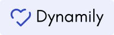

<a href="https://dynamily.ga">
    <p align="center">
        
    </p>
</a>

<p align="center">
    
</p>

<div align="center">
    <strong>Dynamily helps you manage and connect your family's everyday life. </strong>
</div>

<div align=center>
    <sub>💬 Realtime chat &nbsp;·&nbsp; 🖼️ Gallery &nbsp;·&nbsp; ☑️ Todos &nbsp;·&nbsp; 🛒 Shopping list</sub>
</div>
<br>
<div align=center>
    <a href="https://dynamily.ga/login"><strong>Sign up today 🡭</strong></a>
</div>
<br>
<div align="center">
    <sub>Created by <a href="https://github.com/raymon-zhang">Raymon Zhang</a></sub>
</div>

## About

It can be difficult to keep your family organized. Dynamily empowers your family to manage its everyday life and stay connected with realtime chat, a family gallery, and advanced todos and shopping lists.

## Getting Started

First, clone this repository.

**We do not support [npm](https://www.npmjs.com). You must use [yarn](https://yarnpkg.com).**
You can install it with:

```bash
npm i -g yarn
```

Run

```bash
yarn
```

And then you can start the development server:

```bash
yarn dev
```

Open [http://localhost:3000](http://localhost:3000) with your browser to see the result.

You can start editing the page by modifying `pages/index.js`. The page auto-updates as you edit the file.
